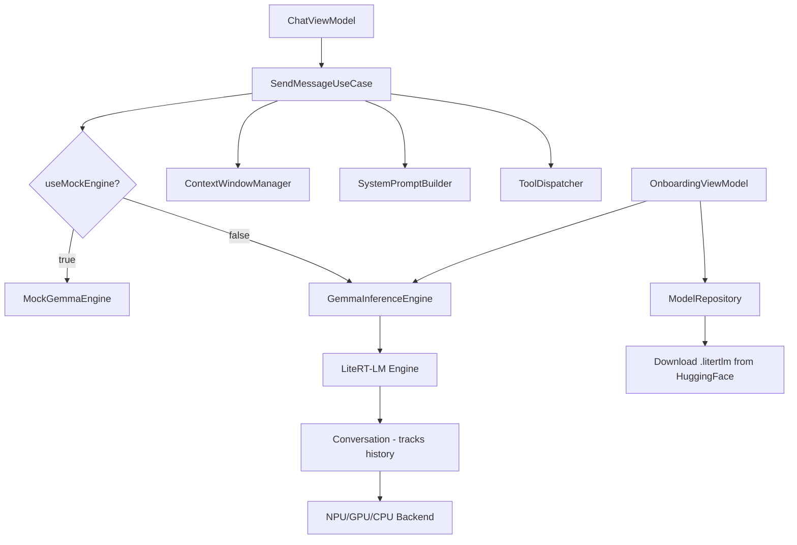
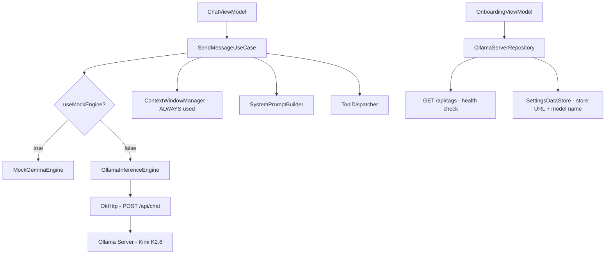
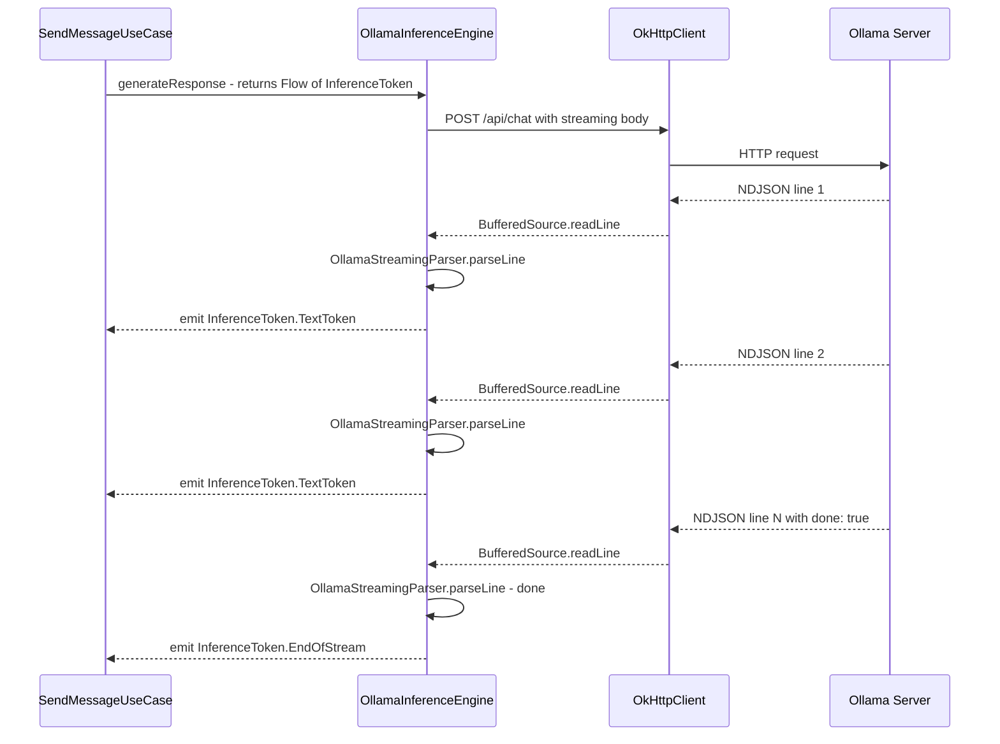
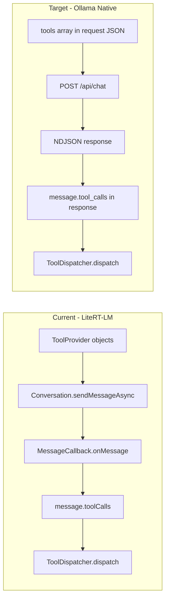
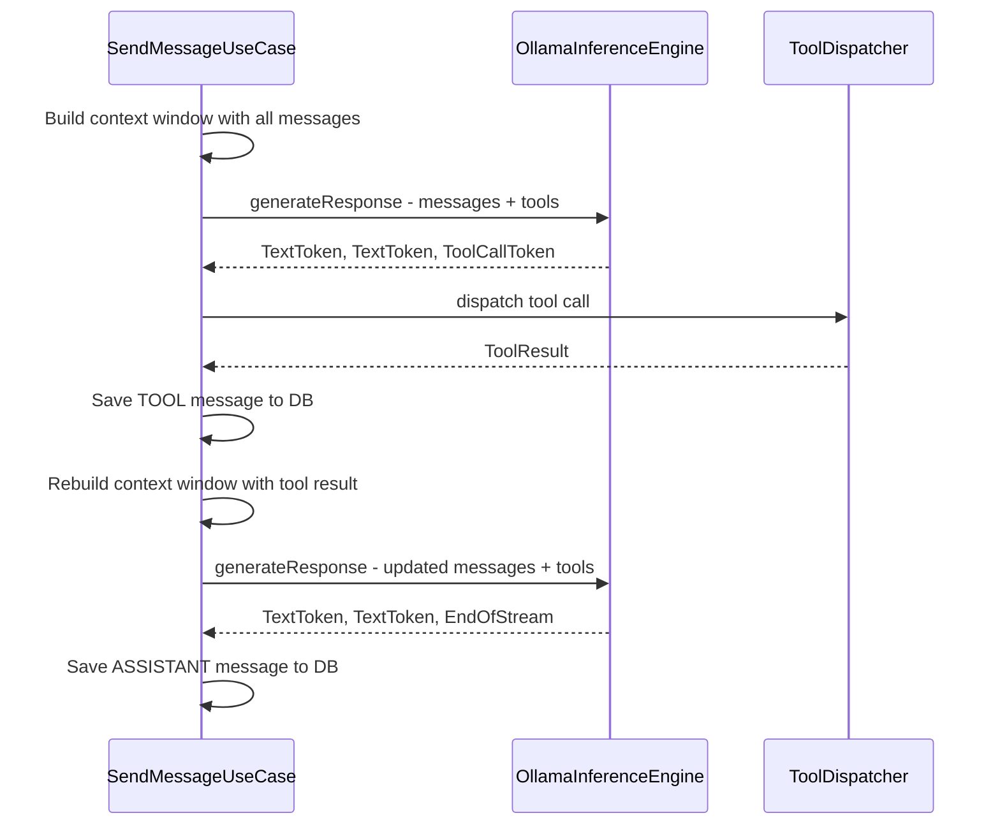
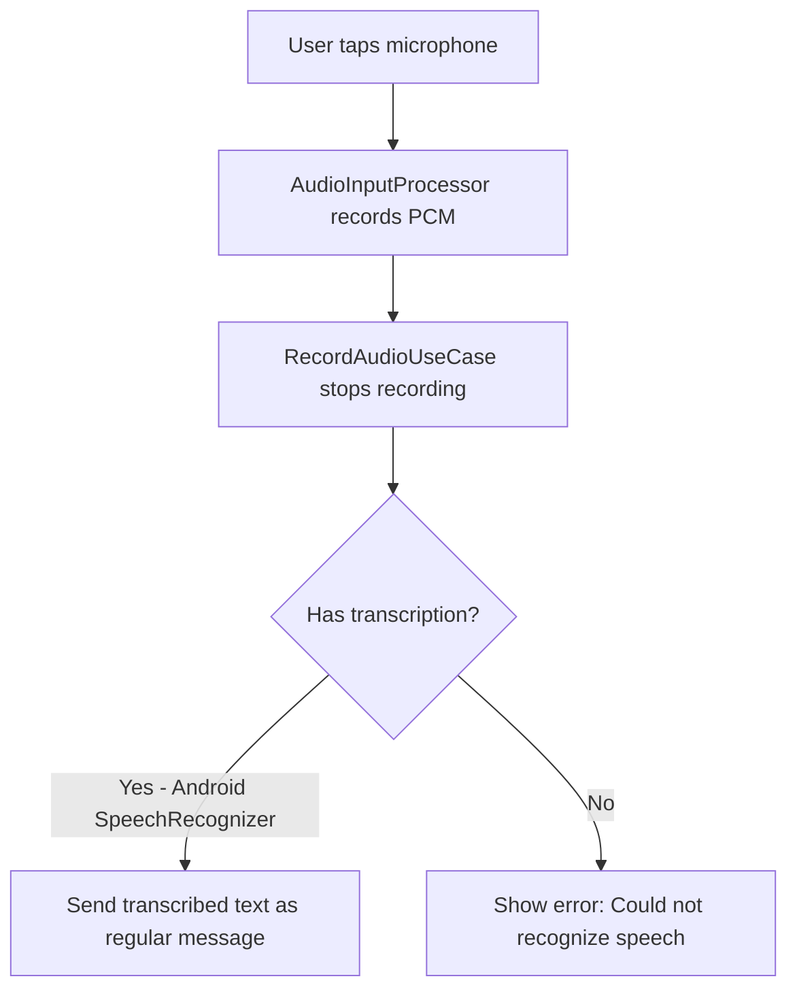
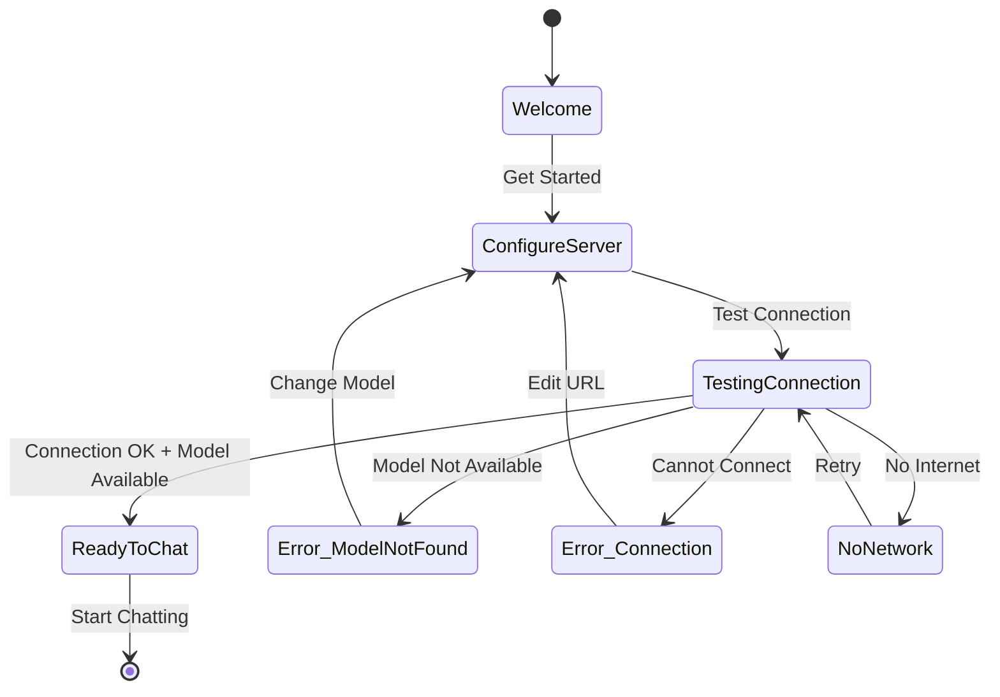

# Ollama Cloud Integration Architecture — LocalAssistant Migration Design

## 1. Executive Summary

This document specifies the architecture for replacing LocalAssistant's on-device Gemma 4 E4B inference (via MediaPipe LiteRT-LM) with **Kimi K2.6 via Ollama REST API** (cloud-hosted). The migration shifts from a 3.65 GB local model file to a stateless HTTP-based inference backend, fundamentally changing the app's initialization, inference, context management, and tool-calling patterns.

### Key Architectural Shifts

| Aspect | Current (Gemma 4 E4B) | Target (Kimi K2.6 via Ollama) |
|---|---|---|
| Inference location | On-device (NPU/GPU/CPU) | Cloud Ollama server |
| Model format | `.litertlm` file (~3.65 GB) | Server-hosted, no local file |
| API style | LiteRT-LM Kotlin callbacks | REST API (NDJSON streaming) |
| Context tracking | `Conversation` object tracks history internally | Stateless — full history sent per request |
| Tool calling | LiteRT-LM native `ToolProvider` + regex fallback | Ollama native `tools` parameter in request |
| Image support | `Content.ImageBytes` in LiteRT-LM | Base64 in `images` field of message |
| Audio support | `Content.AudioBytes` with WAV wrapper | Transcription to text (no native audio API) |
| Initialization | Load model into memory (~30s) | HTTP health check (~1s) |
| Onboarding | Download 3.65 GB model file | Enter server URL + test connection |
| Offline capability | Full offline after download | Requires network connectivity |

---

## 2. Architecture Overview

### Current Architecture



### Target Architecture



### Critical Design Decision: Context Window Management

The current real-engine path **bypasses** `ContextWindowManager` because LiteRT-LM's `Conversation` object tracks history internally. With Ollama's stateless API, **every request must include the full message history**. Therefore:

- `ContextWindowManager.buildContextWindow()` becomes **mandatory** for all inference paths
- `SendMessageUseCase` must always build context before calling the engine
- The `OllamaInferenceEngine` receives pre-built message lists and converts them to Ollama's `messages` array format

---

## 3. Component Change Specifications

### 3.1 Files to CREATE

| File | Purpose |
|---|---|
| `app/src/main/java/com/localassistant/ai/OllamaInferenceEngine.kt` | New inference engine using Ollama REST API |
| `app/src/main/java/com/localassistant/ai/OllamaMessageMapper.kt` | Converts domain `Message` objects to Ollama API format |
| `app/src/main/java/com/localassistant/ai/OllamaStreamingParser.kt` | NDJSON line parser for Ollama streaming responses |
| `app/src/main/java/com/localassistant/data/repository/OllamaServerRepository.kt` | Server URL storage, health checks, model availability |
| `app/src/main/java/com/localassistant/data/repository/ConnectionState.kt` | Sealed class for connection states (replaces download progress for onboarding) |

### 3.2 Files to MODIFY

| File | Changes |
|---|---|
| `app/src/main/java/com/localassistant/domain/usecases/SendMessageUseCase.kt` | Replace `GemmaInferenceEngine` with `OllamaInferenceEngine`; always use context window; update tool loop for Ollama native tool calling |
| `app/src/main/java/com/localassistant/ai/SystemPromptBuilder.kt` | Remove `<start_of_turn>` format references; update tool prompt for Ollama format; keep mode prompts as-is |
| `app/src/main/java/com/localassistant/ai/ContextWindowManager.kt` | Update `MAX_CONTEXT_TOKENS` for Kimi K2.6; add method to build Ollama `messages` array; use server-reported token counts when available |
| `app/src/main/java/com/localassistant/ai/InferenceToken.kt` | No changes — same sealed class interface |
| `app/src/main/java/com/localassistant/ai/ModelLoadState.kt` | Repurpose: `NotLoaded` → Disconnected, `Loading` → Connecting, `Loaded` → Connected, `Error` → Connection error |
| `app/src/main/java/com/localassistant/ai/ModelExceptions.kt` | Add `OllamaConnectionException`, `OllamaTimeoutException`; keep existing exceptions |
| `app/src/main/java/com/localassistant/ui/viewmodels/OnboardingViewModel.kt` | Replace model download flow with server URL input + connection test |
| `app/src/main/java/com/localassistant/ui/viewmodels/OnboardingUiState.kt` | Replace download/verifying states with server config + connection test states |
| `app/src/main/java/com/localassistant/ui/screens/OnboardingScreen.kt` | Replace download UI with server URL input + test connection UI |
| `app/src/main/java/com/localassistant/ui/viewmodels/SettingsViewModel.kt` | Replace model info with Ollama server info; add server URL/model name editing; remove model delete |
| `app/src/main/java/com/localassistant/ui/viewmodels/SettingsUiState.kt` | Replace `ModelInfo` with `OllamaServerInfo`; add server URL/model name fields |
| `app/src/main/java/com/localassistant/ui/screens/SettingsScreen.kt` | Replace model download/delete section with Ollama server configuration |
| `app/src/main/java/com/localassistant/ui/navigation/MainNavigation.kt` | Replace `isModelDownloaded` check with `isServerConfigured` check; remove model auto-init |
| `app/src/main/java/com/localassistant/ui/viewmodels/ChatViewModel.kt` | Update `resetEngineForCurrentConversation` — no-op for Ollama (stateless); update timeout from 60s to 120s for network latency |
| `app/src/main/java/com/localassistant/di/AppModule.kt` | Provide `OllamaInferenceEngine` instead of `GemmaInferenceEngine`; add Ollama-specific OkHttp client with streaming timeouts |
| `app/src/main/java/com/localassistant/data/local/SettingsDataStore.kt` | Add `ollamaServerUrl`, `ollamaModelName` keys |
| `app/src/main/java/com/localassistant/LocalAssistantApp.kt` | Remove models directory creation; no foreground service needed |
| `app/build.gradle.kts` | Remove `com.google.ai.edge.litertlm:litertlm-android:0.10.0`; remove `USE_MOCK_ENGINE` and `USE_TEST_DOWNLOAD` build config fields; add `USE_MOCK_ENGINE` as DataStore preference |
| `app/src/main/AndroidManifest.xml` | Remove `ModelLoadingService` declaration if present; ensure `INTERNET` permission present |

### 3.3 Files to DELETE

| File | Reason |
|---|---|
| `app/src/main/java/com/localassistant/ai/GemmaInferenceEngine.kt` | Replaced by `OllamaInferenceEngine` |
| `app/src/main/java/com/localassistant/data/repository/ModelRepository.kt` | Replaced by `OllamaServerRepository` |
| `app/src/main/java/com/localassistant/data/repository/DownloadProgress.kt` | No longer downloading model files |
| `app/src/main/java/com/localassistant/ai/ModelLoadingService.kt` | No model to keep in memory (if this file exists) |

### 3.4 Files to KEEP UNCHANGED

| File | Reason |
|---|---|
| `app/src/main/java/com/localassistant/ai/MockGemmaEngine.kt` | Still needed for development/CI; rename optional |
| `app/src/main/java/com/localassistant/ai/AudioInputProcessor.kt` | Audio recording still works; transcription path unchanged |
| `app/src/main/java/com/localassistant/ai/AudioRecordingState.kt` | No changes |
| `app/src/main/java/com/localassistant/tools/*` | All 11 tools unchanged — same `Tool` interface |
| `app/src/main/java/com/localassistant/domain/models/*` | All domain models unchanged |
| `app/src/main/java/com/localassistant/data/local/AppDatabase.kt` | Room database unchanged |
| All UI components in `ui/components/` | No changes to reusable components |
| All theme files | No changes |

---

## 4. OllamaInferenceEngine API Design

### Class Signature

```kotlin
@Singleton
class OllamaInferenceEngine @Inject constructor(
    private val okHttpClient: OkHttpClient,          // Streaming-optimized client
    private val systemPromptBuilder: SystemPromptBuilder,
    private val toolRegistry: ToolRegistry,
    private val ollamaServerRepository: OllamaServerRepository,
    private val messageMapper: OllamaMessageMapper
)
```

### Public API Surface

| Method | Signature | Purpose |
|---|---|---|
| `initialize()` | `suspend fun initialize()` | Test connection to Ollama server; verify Kimi K2.6 is available; set `ModelLoadState.Loaded` on success |
| `generateResponse()` | `fun generateResponse(messages: List<Message>, systemPrompt: String, capabilityMode: String, enableThinking: Boolean): Flow<InferenceToken>` | Text-only streaming inference via `POST /api/chat` |
| `generateResponseWithImage()` | `fun generateResponseWithImage(messages: List<Message>, imageBitmap: Bitmap, prompt: String, capabilityMode: String, enableThinking: Boolean): Flow<InferenceToken>` | Vision inference — image encoded as base64 in message `images` field |
| `generateResponseWithAudio()` | `fun generateResponseWithAudio(messages: List<Message>, audioBytes: ByteArray, prompt: String, capabilityMode: String, enableThinking: Boolean): Flow<InferenceToken>` | Audio fallback — transcribes to text, then calls text inference |
| `resetConversation()` | `fun resetConversation(capabilityMode: String, enableThinking: Boolean, ...)` | No-op for Ollama (stateless server) — kept for API compatibility |
| `stopGeneration()` | `fun stopGeneration()` | Cancels the active OkHttp call via `Call.cancel()` |
| `release()` | `fun release()` | No-op — nothing to release from memory |
| `isModelLoaded()` | `fun isModelLoaded(): Boolean` | Returns `true` if `ModelLoadState` is `Loaded` (i.e., server is connected) |
| `modelLoadState` | `val modelLoadState: StateFlow<ModelLoadState>` | Exposes connection state as `StateFlow` |

### Internal State

```kotlin
private val _modelLoadState = MutableStateFlow<ModelLoadState>(ModelLoadState.NotLoaded)
private var activeCall: okhttp3.Call? = null  // For cancellation
private var currentServerUrl: String = ""
private var currentModelName: String = "kimi-k2.6"
```

### Key Design Decisions

1. **Reuses `ModelLoadState` sealed class** — `NotLoaded` = server not configured, `Loading` = testing connection, `Loaded` = server reachable + model available, `Error` = connection failed. This minimizes changes across consumers.

2. **Reuses `Flow<InferenceToken>` return type** — The existing `InferenceToken` sealed class (`TextToken`, `ThinkingToken`, `ToolCallToken`, `EndOfStream`, `Error`) maps perfectly to Ollama's streaming response. No changes needed to `ChatResponseEvent` or `ChatViewModel`.

3. **`resetConversation()` is a no-op** — Ollama is stateless; each request contains full history. The method exists solely for API compatibility with `SendMessageUseCase`.

4. **No foreground service needed** — Unlike the on-device model which required ~4 GB RAM held indefinitely, Ollama requires no resident memory.

---

## 5. Ollama API Integration Details

### 5.1 Endpoints Used

| Endpoint | Method | Purpose | Called By |
|---|---|---|---|
| `/api/tags` | GET | List available models; health check | `OllamaServerRepository.checkConnection()` |
| `/api/chat` | POST | Chat completion with streaming | `OllamaInferenceEngine.generateResponse()` |
| `/api/show` | POST | Show model info (optional) | `OllamaServerRepository.getModelInfo()` |

### 5.2 Chat API Request Format

```json
POST /api/chat
Content-Type: application/json

{
  "model": "kimi-k2.6",
  "messages": [
    {"role": "system", "content": "You are a helpful AI assistant..."},
    {"role": "user", "content": "What is on my calendar today?"},
    {"role": "assistant", "content": "Let me check your calendar."},
    {"role": "tool", "content": "No events found for today", "name": "calendar"},
    {"role": "user", "content": "What about tomorrow?"}
  ],
  "stream": true,
  "options": {
    "num_ctx": 131072,
    "temperature": 0.7,
    "top_k": 40,
    "top_p": 0.95
  },
  "tools": [
    {
      "type": "function",
      "function": {
        "name": "calendar",
        "description": "Read and write calendar events",
        "parameters": {
          "type": "object",
          "properties": {
            "action": {"type": "string", "enum": ["read", "write"]},
            "start_date": {"type": "string"},
            "end_date": {"type": "string"},
            "title": {"type": "string"},
            "location": {"type": "string"}
          },
          "required": ["action"]
        }
      }
    }
  ]
}
```

### 5.3 Chat API Streaming Response (NDJSON)

Each line is a complete JSON object:

```json
{"model":"kimi-k2.6","created_at":"2026-04-21T03:00:00Z","message":{"role":"assistant","content":"Let"},"done":false}
{"model":"kimi-k2.6","created_at":"2026-04-21T03:00:00Z","message":{"role":"assistant","content":" me"},"done":false}
{"model":"kimi-k2.6","created_at":"2026-04-21T03:00:00Z","message":{"role":"assistant","content":" check"},"done":false}
{"model":"kimi-k2.6","created_at":"2026-04-21T03:00:00Z","message":{"role":"assistant","content":"","tool_calls":[{"function":{"name":"calendar","arguments":{"action":"read"}}}]},"done":false}
{"model":"kimi-k2.6","created_at":"2026-04-21T03:00:00Z","message":{"role":"assistant","content":""},"done":true,"total_duration":1500000000,"eval_count":42,"prompt_eval_count":128}
```

### 5.4 Health Check Response

```json
GET /api/tags

{
  "models": [
    {"name": "kimi-k2.6:latest", "size": 7623123456, "modified_at": "2026-04-20T12:00:00Z"},
    {"name": "llama3:latest", "size": 4661224676, "modified_at": "2026-04-19T08:00:00Z"}
  ]
}
```

### 5.5 Message Role Mapping

| Domain `MessageRole` | Ollama `role` field |
|---|---|
| `SYSTEM` | `"system"` |
| `USER` | `"user"` |
| `ASSISTANT` | `"assistant"` |
| `TOOL` | `"tool"` (with `name` field for tool name) |

### 5.6 Image Message Format

```json
{
  "role": "user",
  "content": "Describe this image",
  "images": ["iVBORw0KGgoAAAANSUhEUgAA..."]
}
```

The `images` array accepts base64-encoded PNG/JPEG strings. The `OllamaMessageMapper` converts `Bitmap` → PNG bytes → base64 string.

---

## 6. Streaming Implementation Strategy

### 6.1 OkHttp + NDJSON Parsing

The streaming implementation uses OkHttp's streaming response body with a buffered source reader, parsing NDJSON line-by-line.



### 6.2 OllamaStreamingParser Design

```kotlin
class OllamaStreamingParser {

    /**
     * Parse a single NDJSON line from the Ollama streaming response.
     *
     * @param line A single JSON line from the response stream
     * @return List of InferenceTokens extracted from this line.
     *   A single line may produce multiple tokens (e.g., text + tool_calls).
     *   Returns empty list for empty lines.
     *   Returns InferenceToken.Error for malformed JSON.
     */
    fun parseLine(line: String): List<InferenceToken>

    /**
     * Extract the total token count from the final done=true response.
     * Ollama includes eval_count and prompt_eval_count in the final message.
     */
    fun extractTokenCounts(finalLine: String): TokenCountInfo?
}

data class TokenCountInfo(
    val promptEvalCount: Int,   // Tokens in the prompt
    val evalCount: Int,         // Tokens in the response
    val totalDurationNs: Long   // Total generation time in nanoseconds
)
```

### 6.3 Streaming OkHttp Configuration

A separate OkHttp client for Ollama streaming with appropriate timeouts:

```kotlin
@Provides
@Named("ollama")
@Singleton
fun provideOllamaOkHttpClient(): OkHttpClient {
    return OkHttpClient.Builder()
        .connectTimeout(30, TimeUnit.SECONDS)     // Connection timeout
        .readTimeout(300, TimeUnit.SECONDS)        // 5 min read timeout for long responses
        .writeTimeout(30, TimeUnit.SECONDS)        // Write timeout for request body
        .callTimeout(600, TimeUnit.SECONDS)        // 10 min overall call timeout
        .connectionPool(ConnectionPool(5, 5, TimeUnit.MINUTES))
        .protocols(listOf(Protocol.HTTP_2, Protocol.HTTP_1_1))
        .build()
}
```

### 6.4 Flow Implementation Pattern

```kotlin
fun generateResponse(
    messages: List<Message>,
    systemPrompt: String,
    capabilityMode: String,
    enableThinking: Boolean
): Flow<InferenceToken> = callbackFlow {
    val ollamaMessages = messageMapper.mapToOllamaMessages(messages, systemPrompt)
    val tools = messageMapper.mapToOllamaTools(toolRegistry.getAllTools())

    val requestBody = buildChatRequestBody(
        model = currentModelName,
        messages = ollamaMessages,
        tools = tools,
        stream = true,
        options = buildOptions()
    )

    val request = Request.Builder()
        .url("${currentServerUrl}/api/chat")
        .post(requestBody)
        .build()

    val call = okHttpClient.newCall(request)
    activeCall = call

    try {
        val response = call.execute()
        if (!response.isSuccessful) {
            trySend(InferenceToken.Error("Server error: ${response.code} ${response.message}"))
            trySend(InferenceToken.EndOfStream)
            close()
            return@callbackFlow
        }

        val source = response.body?.source()
            ?: throw IllegalStateException("Empty response body")

        val parser = OllamaStreamingParser()

        while (!source.exhausted()) {
            val line = source.readUtf8Line() ?: break
            if (line.isBlank()) continue

            val tokens = parser.parseLine(line)
            for (token in tokens) {
                trySend(token)
            }

            // Check if stream is done
            if (tokens.any { it is InferenceToken.EndOfStream }) {
                break
            }
        }

        response.close()
    } catch (e: CancellationException) {
        // User cancelled — this is expected from stopGeneration()
        trySend(InferenceToken.EndOfStream)
    } catch (e: java.net.SocketTimeoutException) {
        trySend(InferenceToken.Error("Request timed out. The server may be overloaded."))
    } catch (e: java.net.ConnectException) {
        trySend(InferenceToken.Error("Cannot connect to Ollama server at $currentServerUrl"))
    } catch (e: Exception) {
        trySend(InferenceToken.Error("Inference error: ${e.message}"))
    } finally {
        activeCall = null
    }

    awaitClose {
        activeCall?.cancel()
        activeCall = null
    }
}.flowOn(Dispatchers.IO)
```

---

## 7. Tool Calling Integration

### 7.1 Current vs. Target Tool Calling



### 7.2 Ollama Tool Schema Format

The `OllamaMessageMapper` converts each `Tool` from the `ToolRegistry` into Ollama's tool format:

```kotlin
fun mapToOllamaTools(tools: List<Tool>): List<JsonObject> {
    return tools.map { tool ->
        buildJsonObject {
            put("type", "function")
            put("function", buildJsonObject {
                put("name", tool.name)
                put("description", tool.description)
                put("parameters", tool.getParameterSchema())
            }.toString())
        }
    }
}
```

### 7.3 Tool Call Response Parsing

When the model produces a tool call, the Ollama streaming response includes:

```json
{
  "message": {
    "role": "assistant",
    "content": "",
    "tool_calls": [
      {
        "function": {
          "name": "calendar",
          "arguments": {"action": "read", "start_date": "2026-04-21"}
        }
      }
    ]
  },
  "done": false
}
```

The `OllamaStreamingParser` extracts this and emits `InferenceToken.ToolCallToken`:

```kotlin
// In OllamaStreamingParser.parseLine()
if (messageObj.has("tool_calls")) {
    val toolCallsArray = messageObj.getJSONArray("tool_calls")
    for (i in 0 until toolCallsArray.length()) {
        val functionObj = toolCallsArray
            .getJSONObject(i)
            .getJSONObject("function")
        val name = functionObj.getString("name")
        val arguments = Json.decodeFromString<JsonObject>(
            functionObj.getJSONObject("arguments").toString()
        )
        tokens.add(InferenceToken.ToolCallToken(
            ToolCall(name = name, arguments = arguments, callId = "")
        ))
    }
}
```

### 7.4 Tool Result Injection

After executing tools, results are sent back as `role: "tool"` messages in the next request:

```kotlin
// In OllamaMessageMapper
fun mapToolResultToMessage(toolResult: ToolResult): JsonObject {
    return buildJsonObject {
        put("role", "tool")
        put("content", toolResult.result)
        put("name", toolResult.name)
    }
}
```

### 7.5 Agentic Tool Loop Changes in SendMessageUseCase

The current `SendMessageUseCase.generateWithToolLoop()` needs these changes:

1. **Always build context window** — Since Ollama is stateless, every iteration must include full message history
2. **Include tool results in message history** — Tool results are added as `role: "tool"` messages in the Ollama `messages` array
3. **Remove the "send tool results as user message" hack** — The current code sends tool results as a fake user message. With Ollama's native tool calling, results go in proper `tool` role messages
4. **Keep MAX_TOOL_ITERATIONS = 3** — Same limit applies



---

## 8. Multimodal Handling

### 8.1 Image Support (Base64 Encoding)

Ollama supports images natively via the `images` field in user messages. The `OllamaMessageMapper` handles conversion:

```kotlin
fun mapImageMessage(
    textContent: String,
    imageBitmap: Bitmap
): JsonObject {
    val stream = ByteArrayOutputStream()
    imageBitmap.compress(Bitmap.CompressFormat.PNG, 100, stream)
    val base64Image = Base64.encodeToString(stream.toByteArray(), Base64.NO_WRAP)

    return buildJsonObject {
        put("role", "user")
        put("content", textContent)
        putJsonArray("images") {
            add(base64Image)
        }
    }
}
```

**Key difference from current**: The current engine sends `Content.ImageBytes` to LiteRT-LM. With Ollama, the image is base64-encoded and included in the JSON request body. This increases request payload size significantly (a 1080p PNG is ~2-4 MB base64), so we should:

1. **Compress images** — Resize to max 1024px on the longest side before encoding
2. **Use JPEG for photos** — JPEG at 85% quality is much smaller than PNG for photographs
3. **Consider WebP** — Even smaller, but Ollama compatibility should be verified

### 8.2 Audio Fallback Strategy

Ollama does not natively support audio input. The fallback strategy:



**Implementation**:

1. `generateResponseWithAudio()` in `OllamaInferenceEngine` will:
   - NOT send audio bytes to the server (Ollama doesn't support it)
   - Instead, rely on the existing `RecordAudioUseCase` which already uses Android's `SpeechRecognizer` for transcription
   - The transcribed text is sent as a regular text message via `generateResponse()`
   - The audio bytes are discarded after transcription

2. The `ChatViewModel.sendAudioMessage()` already calls `recordAudioUseCase.stopRecording()` which returns a transcription string. This transcription is then sent via `sendMessage(text)`. **No changes needed in ChatViewModel** — the audio → text path already works.

3. The `sendMessageWithAudio()` method in `SendMessageUseCase` should be updated to:
   - If using Ollama engine: save the user message as text (the transcription), call `generateResponse()` instead of `generateResponseWithAudio()`
   - If using mock engine: keep existing behavior for testing

### 8.3 Image + Audio Conversation Mode

The current `ensureConversation()` method resets the `Conversation` when switching between text/image/audio modes. With Ollama, this is unnecessary — the server handles all modalities in the same chat endpoint. The `resetConversation()` call becomes a no-op.

---

## 9. Error Handling Strategy

### 9.1 Error Categories

| Category | Example | User Message | Recovery |
|---|---|---|---|
| **Network Unreachable** | `ConnectException` | Cannot connect to Ollama server. Check your network connection and server URL. | Retry / reconfigure URL |
| **Timeout** | `SocketTimeoutException` | The request timed out. The server may be overloaded. | Retry with backoff |
| **Server Error** | HTTP 500/502/503 | Server error: 503 Service Unavailable. Please try again later. | Retry with exponential backoff |
| **Model Not Found** | HTTP 404 on `/api/tags` | Model kimi-k2.6 is not available on the server. Contact your administrator. | Change model name in settings |
| **Authentication** | HTTP 401/403 | Authentication required. Check your server configuration. | Configure auth in settings |
| **Context Too Long** | HTTP 400 with context error | The conversation is too long. Starting a new chat may help. | Truncate context or new chat |
| **Rate Limited** | HTTP 429 | Too many requests. Please wait a moment and try again. | Retry after delay |
| **Malformed Response** | JSON parse error | Received an invalid response from the server. | Retry |
| **Cancelled** | `CancellationException` | (Silent — user pressed stop) | No action needed |

### 9.2 Retry Strategy

```kotlin
class OllamaRetryPolicy {
    companion object {
        const val MAX_RETRIES = 3
        val RETRYABLE_STATUS_CODES = setOf(408, 429, 500, 502, 503, 504)
        val BACKOFF_BASE_MS = 1000L  // 1s, 2s, 4s
    }

    fun shouldRetry(exception: Exception, attempt: Int): Boolean {
        if (attempt >= MAX_RETRIES) return false
        return when (exception) {
            is SocketTimeoutException -> true
            is ConnectException -> attempt < 2  // Only retry twice for connection issues
            is HttpException -> exception.statusCode in RETRYABLE_STATUS_CODES
            else -> false
        }
    }

    fun getBackoffDelayMs(attempt: Int): Long {
        return BACKOFF_BASE_MS * (1L shl attempt)  // Exponential: 1s, 2s, 4s
    }
}
```

### 9.3 Connection State Monitoring

The `OllamaInferenceEngine` should periodically verify server connectivity:

```kotlin
// In OllamaInferenceEngine
private fun startConnectionMonitor() {
    coroutineScope.launch {
        while (isActive) {
            delay(30_000) // Check every 30 seconds
            try {
                val isAvailable = ollamaServerRepository.isModelAvailable()
                if (!isAvailable && _modelLoadState.value is ModelLoadState.Loaded) {
                    _modelLoadState.value = ModelLoadState.Error("Server connection lost")
                } else if (isAvailable && _modelLoadState.value !is ModelLoadState.Loaded) {
                    _modelLoadState.value = ModelLoadState.Loaded
                }
            } catch (_: Exception) { }
        }
    }
}
```

### 9.4 Offline Handling

Since the app now requires network connectivity:

1. **Pre-send network check** — Before calling `sendMessage()`, check `ConnectivityManager` for active network
2. **Queue messages offline** — If network is lost, show a clear error: "No internet connection. This app requires a connection to the Ollama server."
3. **No offline mode** — Unlike the on-device model, there is no offline fallback. The mock engine can serve as a development fallback but should not be exposed to end users as an offline mode.

---

## 10. Onboarding Flow Redesign

### 10.1 New Onboarding States

Replace `OnboardingUiState` with:

```kotlin
sealed class OnboardingUiState {
    // Step 1: Welcome screen
    data object Welcome : OnboardingUiState()

    // Step 2: Enter server URL
    data class ConfigureServer(
        val serverUrl: String = "",
        val modelName: String = "kimi-k2.6",
        val isValidUrl: Boolean = false
    ) : OnboardingUiState()

    // Step 3: Testing connection
    data class TestingConnection(
        val serverUrl: String = "",
        val modelName: String = "kimi-k2.6",
        val step: String = "Connecting..."
    ) : OnboardingUiState()

    // Step 4: Ready to chat
    data object ReadyToChat : OnboardingUiState()

    // Error states
    data class Error(
        val message: String,
        val isRetryable: Boolean,
        val serverUrl: String = "",
        val modelName: String = "kimi-k2.6"
    ) : OnboardingUiState()

    // Network unavailable
    data object NoNetwork : OnboardingUiState()
}
```

### 10.2 Onboarding Flow Diagram



### 10.3 Onboarding Screen Changes

| Current Screen | Replacement |
|---|---|
| Welcome (same) | Welcome — update subtitle from "running entirely on your device" to "powered by Kimi K2.6 via Ollama" |
| CheckingModel | **Removed** — no RAM/storage check needed |
| ReadyToDownload | **ConfigureServer** — URL input field + model name field + "Test Connection" button |
| NetworkWarning | **Removed** — no 3.6 GB download to warn about |
| Downloading | **TestingConnection** — spinner + "Connecting to server..." / "Verifying model..." |
| Verifying | **Removed** — no file integrity check |
| InsufficientRam | **Removed** — no local model to load |
| InsufficientStorage | **Removed** — no model file to store |
| ReadyToChat (same) | ReadyToChat — update text to "Connected to Ollama server" |
| Error | Error — update messages for connection failures |

### 10.4 OnboardingViewModel Changes

```kotlin
@HiltViewModel
class OnboardingViewModel @Inject constructor(
    private val ollamaServerRepository: OllamaServerRepository,
    private val ollamaInferenceEngine: OllamaInferenceEngine,
    private val settingsDataStore: SettingsDataStore
) : ViewModel() {

    fun checkPrerequisites() {
        // No RAM/storage check — just check network
        viewModelScope.launch {
            if (!ollamaServerRepository.isNetworkAvailable()) {
                _uiState.value = OnboardingUiState.NoNetwork
            } else {
                _uiState.value = OnboardingUiState.ConfigureServer()
            }
        }
    }

    fun testConnection(serverUrl: String, modelName: String) {
        viewModelScope.launch {
            _uiState.value = OnboardingUiState.TestingConnection(
                serverUrl = serverUrl,
                modelName = modelName,
                step = "Connecting to server..."
            )

            try {
                // Save URL and model name
                settingsDataStore.setOllamaServerUrl(serverUrl)
                settingsDataStore.setOllamaModelName(modelName)

                // Update engine configuration
                ollamaInferenceEngine.configure(serverUrl, modelName)

                // Test connection
                _uiState.value = OnboardingUiState.TestingConnection(
                    serverUrl = serverUrl,
                    modelName = modelName,
                    step = "Verifying model availability..."
                )

                ollamaInferenceEngine.initialize()

                _uiState.value = OnboardingUiState.ReadyToChat
            } catch (e: ModelNotFoundException) {
                _uiState.value = OnboardingUiState.Error(
                    message = "Model '$modelName' is not available on the server.",
                    isRetryable = true,
                    serverUrl = serverUrl,
                    modelName = modelName
                )
            } catch (e: Exception) {
                _uiState.value = OnboardingUiState.Error(
                    message = "Cannot connect to server: ${e.message}",
                    isRetryable = true,
                    serverUrl = serverUrl,
                    modelName = modelName
                )
            }
        }
    }
}
```

---

## 11. Settings UI Changes

### 11.1 SettingsUiState Changes

```kotlin
data class SettingsUiState(
    // ── Existing (keep) ──
    val darkMode: Boolean = false,
    val thinkingMode: Boolean = true,
    val streamTokens: Boolean = true,
    val voiceAutoPlay: Boolean = false,
    val allowWebSearch: Boolean = false,
    val memoryCount: Int = 0,
    val memories: List<Memory> = emptyList(),
    val isMemorySectionExpanded: Boolean = false,
    val memorySearchQuery: String = "",
    val searchResults: List<Memory> = emptyList(),
    val memoryTransparencyText: String = "",
    val showClearMemoriesDialog: Boolean = false,

    // ── Replaced ──
    val ollamaServerInfo: OllamaServerInfo = OllamaServerInfo(),
    // REMOVED: modelInfo, storageInfo, showDeleteModelDialog, allowCellularDownload
)

data class OllamaServerInfo(
    val serverUrl: String = "",
    val modelName: String = "kimi-k2.6",
    val isConnected: Boolean = false,
    val availableModels: List<String> = emptyList(),
    val latencyMs: Long = 0L,
    val lastCheckedAt: String = ""
)
```

### 11.2 Settings Screen Layout Changes

| Current Section | Change |
|---|---|
| **Model Info** card (Gemma 4 E4B, size, loaded status) | Replace with **Ollama Server** card: URL, model name, connection status, latency |
| **Delete Model** button | Replace with **Test Connection** button |
| **Storage Info** card (model size, DB size, available) | Remove model size; keep DB size if desired |
| **Allow Cellular Download** toggle | Remove — no large downloads |
| **Temperature / Top-K** sliders | Keep — these map to Ollama `options.temperature` and `options.top_k` |
| **Server URL** field | **NEW** — editable text field with URL validation |
| **Model Name** field | **NEW** — editable text field, default "kimi-k2.6" |
| **Refresh Models** button | **NEW** — calls `GET /api/tags` and populates available models list |

### 11.3 SettingsViewModel Changes

```kotlin
// Removed methods:
// fun showDeleteModelDialog()
// fun dismissDeleteModelDialog()
// fun deleteModel()
// fun toggleAllowCellularDownload()

// New methods:
fun updateServerUrl(url: String)
fun updateModelName(name: String)
fun testConnection()  // Calls ollamaServerRepository.checkConnection()
fun refreshAvailableModels()  // Calls GET /api/tags
```

---

## 12. OllamaServerRepository Design

### 12.1 Class Definition

```kotlin
@Singleton
class OllamaServerRepository @Inject constructor(
    @ApplicationContext private val context: Context,
    @Named("ollama") private val okHttpClient: OkHttpClient,
    private val settingsDataStore: SettingsDataStore
) {
    companion object {
        const val DEFAULT_SERVER_URL = "http://localhost:11434"
        const val DEFAULT_MODEL_NAME = "kimi-k2.6"
    }

    // ── Server Configuration ──

    suspend fun getServerUrl(): String
    suspend fun setServerUrl(url: String)
    suspend fun getModelName(): String
    suspend fun setModelName(name: String)
    fun isServerConfigured(): Boolean

    // ── Health Checks ──

    suspend fun checkConnection(): ConnectionResult
    suspend fun isModelAvailable(modelName: String = getModelName()): Boolean
    suspend fun getAvailableModels(): List<OllamaModel>
    suspend fun getModelInfo(modelName: String): OllamaModelInfo?
    suspend fun measureLatency(): Long  // Returns round-trip time in ms

    // ── Network ──

    fun isNetworkAvailable(): Boolean
    fun getNetworkType(): String  // "WiFi", "Cellular", "Ethernet", "None"
}

sealed class ConnectionResult {
    data class Success(val availableModels: List<String>, val latencyMs: Long) : ConnectionResult()
    data class Unreachable(val message: String) : ConnectionResult()
    data class ModelNotFound(val availableModels: List<String>, val requestedModel: String) : ConnectionResult()
    data class Error(val message: String, val cause: Throwable? = null) : ConnectionResult()
}

data class OllamaModel(
    val name: String,
    val size: Long,
    val modifiedAt: String
)
```

### 12.2 Persistence

Server URL and model name are stored in `SettingsDataStore` (DataStore Preferences):

```kotlin
// New keys in SettingsDataStore
val KEY_OLLAMA_SERVER_URL = stringPreferencesKey("ollama_server_url")
val KEY_OLLAMA_MODEL_NAME = stringPreferencesKey("ollama_model_name")

val ollamaServerUrl: Flow<String> = context.settingsDataStore.data.map {
    it[KEY_OLLAMA_SERVER_URL] ?: DEFAULT_SERVER_URL
}
val ollamaModelName: Flow<String> = context.settingsDataStore.data.map {
    it[KEY_OLLAMA_MODEL_NAME] ?: DEFAULT_MODEL_NAME
}

suspend fun setOllamaServerUrl(url: String) {
    context.settingsDataStore.edit { it[KEY_OLLAMA_SERVER_URL] = url }
}
suspend fun setOllamaModelName(name: String) {
    context.settingsDataStore.edit { it[KEY_OLLAMA_MODEL_NAME] = name }
}
```

---

## 13. OllamaMessageMapper Design

### 13.1 Class Definition

```kotlin
@Singleton
class OllamaMessageMapper @Inject constructor() {

    /**
     * Convert a list of domain Message objects + system prompt
     * into the Ollama API messages array format.
     */
    fun mapToOllamaMessages(
        messages: List<Message>,
        systemPrompt: String
    ): List<JsonObject>

    /**
     * Convert ToolRegistry tools into Ollama tools array format.
     */
    fun mapToOllamaTools(tools: List<Tool>): List<JsonObject>

    /**
     * Create a user message with an image attachment.
     */
    fun mapImageMessage(textContent: String, base64Image: String): JsonObject

    /**
     * Create a tool result message.
     */
    fun mapToolResultMessage(toolName: String, result: String): JsonObject
}
```

### 13.2 Message Mapping Logic

```kotlin
fun mapToOllamaMessages(
    messages: List<Message>,
    systemPrompt: String
): List<JsonObject> {
    val result = mutableListOf<JsonObject>()

    // 1. System message first
    result.add(buildJsonObject {
        put("role", "system")
        put("content", systemPrompt)
    })

    // 2. Map each domain message
    for (message in messages) {
        when (message.role) {
            MessageRole.USER -> result.add(buildJsonObject {
                put("role", "user")
                put("content", message.content)
                // If message has an image attachment, add images field
                message.imageBase64?.let { img ->
                    putJsonArray("images") { add(img) }
                }
            })
            MessageRole.ASSISTANT -> result.add(buildJsonObject {
                put("role", "assistant")
                put("content", message.content)
            })
            MessageRole.TOOL -> result.add(buildJsonObject {
                put("role", "tool")
                put("content", message.toolResult ?: message.content)
                put("name", message.toolName ?: "unknown")
            })
            MessageRole.SYSTEM -> { /* Skip — system prompt is already added */ }
        }
    }

    return result
}
```

---

## 14. ContextWindowManager Updates

### 14.1 Changes Required

| Aspect | Current | Target |
|---|---|---|
| `MAX_CONTEXT_TOKENS` | 128,000 | 131,072 (Kimi K2.6's `num_ctx` default) |
| `TRUNCATION_THRESHOLD` | 100,000 | 110,000 |
| Token estimation | Heuristic (chars/words) | Heuristic + server-reported counts when available |
| Usage | Only used for mock engine | **Always used** — mandatory for Ollama |

### 14.2 New Method: Build Ollama Messages

Add a convenience method that combines context window building with Ollama message formatting:

```kotlin
/**
 * Build a context window and format as Ollama messages array.
 * This is the primary entry point for SendMessageUseCase.
 */
fun buildOllamaContextMessages(
    messages: List<Message>,
    systemPrompt: String,
    memories: List<Memory> = emptyList()
): List<Message> {
    // Same logic as buildContextWindow, but returns trimmed messages
    // that the OllamaMessageMapper will then convert to Ollama format
    return buildContextWindow(messages, systemPrompt, memories)
}
```

### 14.3 Server-Reported Token Counts

Ollama's final streaming response includes actual token counts:

```json
{"done": true, "prompt_eval_count": 128, "eval_count": 42}
```

These should be used to calibrate the heuristic estimator:

```kotlin
/**
 * Update token estimation heuristics based on server-reported counts.
 * This improves accuracy over time.
 */
fun updateEstimationCalibration(estimatedTokens: Int, actualTokens: Int) {
    // Adjust charsPerToken ratio based on observed ratio
    calibrationFactor = actualTokens.toFloat() / estimatedTokens.toFloat()
}
```

---

## 15. DI Wiring Changes

### 15.1 AppModule Updates

```kotlin
@Module
@InstallIn(SingletonComponent::class)
object AppModule {

    // Keep existing OkHttpClient (for WebSearch, general HTTP)
    @Provides
    @Singleton
    fun provideOkHttpClient(): OkHttpClient { /* ... existing ... */ }

    // NEW: Ollama-specific OkHttpClient with streaming timeouts
    @Provides
    @Named("ollama")
    @Singleton
    fun provideOllamaOkHttpClient(): OkHttpClient {
        return OkHttpClient.Builder()
            .connectTimeout(30, TimeUnit.SECONDS)
            .readTimeout(300, TimeUnit.SECONDS)
            .writeTimeout(30, TimeUnit.SECONDS)
            .callTimeout(600, TimeUnit.SECONDS)
            .connectionPool(ConnectionPool(5, 5, TimeUnit.MINUTES))
            .protocols(listOf(Protocol.HTTP_2, Protocol.HTTP_1_1))
            .build()
    }

    // REMOVED: provideModelsDir() — no local model files
    // REMOVED: provideCacheDir() — no AI cache needed
}
```

### 15.2 New AIModule

```kotlin
@Module
@InstallIn(SingletonComponent::class)
object AIModule {

    @Provides
    @Singleton
    fun provideOllamaInferenceEngine(
        @Named("ollama") okHttpClient: OkHttpClient,
        systemPromptBuilder: SystemPromptBuilder,
        toolRegistry: ToolRegistry,
        ollamaServerRepository: OllamaServerRepository,
        messageMapper: OllamaMessageMapper
    ): OllamaInferenceEngine {
        return OllamaInferenceEngine(
            okHttpClient, systemPromptBuilder, toolRegistry,
            ollamaServerRepository, messageMapper
        )
    }

    @Provides
    @Singleton
    fun provideOllamaMessageMapper(): OllamaMessageMapper {
        return OllamaMessageMapper()
    }

    @Provides
    @Singleton
    fun provideOllamaStreamingParser(): OllamaStreamingParser {
        return OllamaStreamingParser()
    }

    @Provides
    @Named("useMockEngine")
    fun provideUseMockEngine(settingsDataStore: SettingsDataStore): Boolean {
        // Read from DataStore instead of BuildConfig
        // Default to false for production
        return runBlocking { settingsDataStore.useMockEngine.first() }
    }
}
```

### 15.3 SendMessageUseCase DI Changes

```kotlin
// Current constructor:
class SendMessageUseCase @Inject constructor(
    private val gemmaInferenceEngine: GemmaInferenceEngine,
    private val mockEngine: MockGemmaEngine,
    @Named("useMockEngine") private val useMockEngine: Boolean,
    ...
)

// Target constructor:
class SendMessageUseCase @Inject constructor(
    private val ollamaInferenceEngine: OllamaInferenceEngine,
    private val mockEngine: MockGemmaEngine,
    @Named("useMockEngine") private val useMockEngine: Boolean,
    ...
)
```

---

## 16. Build Configuration Changes

### 16.1 build.gradle.kts Modifications

```kotlin
dependencies {
    // ── REMOVED ──
    // implementation("com.google.ai.edge.litertlm:litertlm-android:0.10.0")

    // ── KEPT ──
    implementation("com.squareup.okhttp3:okhttp:4.12.0")  // Already present
    implementation("org.jetbrains.kotlinx:kotlinx-serialization-json:1.7.3")  // Already present
}

android {
    buildTypes {
        release {
            // REMOVED: buildConfigField("Boolean", "USE_MOCK_ENGINE", "false")
            // REMOVED: buildConfigField("Boolean", "USE_TEST_DOWNLOAD", "false")
        }
        debug {
            // REMOVED: buildConfigField("Boolean", "USE_MOCK_ENGINE", "false")
            // REMOVED: buildConfigField("Boolean", "USE_TEST_DOWNLOAD", "false")
        }
    }
}
```

### 16.2 Mock Engine as DataStore Preference

Move `USE_MOCK_ENGINE` from `BuildConfig` to `SettingsDataStore`:

```kotlin
// In SettingsDataStore
val KEY_USE_MOCK_ENGINE = booleanPreferencesKey("use_mock_engine")
val useMockEngine: Flow<Boolean> = context.settingsDataStore.data.map {
    it[KEY_USE_MOCK_ENGINE] ?: false
}
suspend fun setUseMockEngine(value: Boolean) {
    context.settingsDataStore.edit { it[KEY_USE_MOCK_ENGINE] = value }
}
```

This allows toggling mock mode at runtime from Settings, which is more flexible than a build-time flag.

---

## 17. MainNavigation Changes

### 17.1 Start Destination Logic

```kotlin
// Current:
val isModelReady = remember {
    val downloaded = modelRepository.isModelDownloaded()
    downloaded
}
val startDestination = if (isModelReady) "chat" else "onboarding"

// Target:
val isServerConfigured = remember {
    ollamaServerRepository.isServerConfigured()
}
val startDestination = if (isServerConfigured) "chat" else "onboarding"
```

### 17.2 Remove Model Auto-Initialization

The current `MainNavigation` has a `LaunchedEffect` that auto-initializes the model if it's already downloaded. With Ollama, this becomes a connection check:

```kotlin
// Current:
if (isModelReady) {
    LaunchedEffect(Unit) {
        gemmaInferenceEngine.initialize()
    }
}

// Target:
if (isServerConfigured) {
    LaunchedEffect(Unit) {
        try {
            ollamaInferenceEngine.initialize()  // Quick health check
        } catch (e: Exception) {
            // If server is unreachable, navigate to onboarding
            navController.navigate("onboarding") {
                popUpTo("chat") { inclusive = true }
            }
        }
    }
}
```

### 17.3 Function Signature Change

```kotlin
// Current:
@Composable
fun MainNavigation(
    sharedText: String? = null,
    sharedImageUris: List<String> = emptyList(),
    onSharedContentConsumed: () -> Unit = {},
    modelRepository: ModelRepository,
    gemmaInferenceEngine: GemmaInferenceEngine
)

// Target:
@Composable
fun MainNavigation(
    sharedText: String? = null,
    sharedImageUris: List<String> = emptyList(),
    onSharedContentConsumed: () -> Unit = {},
    ollamaServerRepository: OllamaServerRepository,
    ollamaInferenceEngine: OllamaInferenceEngine
)
```

---

## 18. Migration Checklist

### Phase 1: Foundation (No UI changes yet)

- [ ] Create `OllamaStreamingParser.kt` — NDJSON line parser
- [ ] Create `OllamaMessageMapper.kt` — Domain messages → Ollama API format
- [ ] Create `OllamaServerRepository.kt` — Server URL storage, health checks
- [ ] Create `ConnectionState.kt` — Connection state sealed class
- [ ] Add `KEY_OLLAMA_SERVER_URL`, `KEY_OLLAMA_MODEL_NAME`, `KEY_USE_MOCK_ENGINE` to `SettingsDataStore.kt`
- [ ] Update `AppModule.kt` — Add `@Named("ollama")` OkHttpClient; remove `provideModelsDir()`
- [ ] Create `AIModule.kt` — Wire `OllamaInferenceEngine`, `OllamaMessageMapper`, `OllamaStreamingParser`

### Phase 2: Inference Engine

- [ ] Create `OllamaInferenceEngine.kt` — Full implementation with streaming
- [ ] Update `ModelExceptions.kt` — Add `OllamaConnectionException`, `OllamaTimeoutException`
- [ ] Update `ContextWindowManager.kt` — Change `MAX_CONTEXT_TOKENS` to 131072; add calibration method
- [ ] Update `SystemPromptBuilder.kt` — Remove `<start_of_turn>` references; update tool prompt format for Ollama

### Phase 3: Use Case Layer

- [ ] Update `SendMessageUseCase.kt` — Replace `GemmaInferenceEngine` with `OllamaInferenceEngine`; always use context window; update tool loop for native Ollama tool calling; update audio path
- [ ] Verify `ChatResponseEvent.kt` — No changes needed
- [ ] Verify `InferenceToken.kt` — No changes needed

### Phase 4: Onboarding

- [ ] Update `OnboardingUiState.kt` — Replace download states with server config states
- [ ] Update `OnboardingViewModel.kt` — Replace download flow with server config + connection test
- [ ] Update `OnboardingScreen.kt` — Replace download UI with server URL input + test connection

### Phase 5: Settings

- [ ] Update `SettingsUiState.kt` — Replace `ModelInfo` with `OllamaServerInfo`; remove storage/download fields
- [ ] Update `SettingsViewModel.kt` — Replace model management with Ollama server management
- [ ] Update `SettingsScreen.kt` — Replace model section with Ollama server configuration

### Phase 6: Navigation & Chat

- [ ] Update `MainNavigation.kt` — Replace model readiness check with server configured check; update function signature
- [ ] Update `ChatViewModel.kt` — Update `resetEngineForCurrentConversation` (no-op for Ollama); increase timeout to 120s
- [ ] Update `MainActivity.kt` — Update `MainNavigation` call with new parameters

### Phase 7: Build & Cleanup

- [ ] Update `app/build.gradle.kts` — Remove LiteRT-LM dependency; remove `USE_MOCK_ENGINE`/`USE_TEST_DOWNLOAD` build config fields
- [ ] Delete `GemmaInferenceEngine.kt`
- [ ] Delete `ModelRepository.kt`
- [ ] Delete `DownloadProgress.kt`
- [ ] Delete `ModelLoadingService.kt` (if it exists)
- [ ] Update `LocalAssistantApp.kt` — Remove models directory creation; remove foreground service
- [ ] Update `AndroidManifest.xml` — Remove `ModelLoadingService` declaration; verify `INTERNET` permission
- [ ] Update unit tests — Remove `DownloadResumeTest.kt`; update `AgenticAbilitiesTest.kt` for Ollama
- [ ] Update instrumented tests — Update `DataLayerIntegrationTest.kt` for Ollama

### Phase 8: Testing & Validation

- [ ] Test onboarding flow: Welcome → Configure Server → Test Connection → Ready to Chat
- [ ] Test chat with streaming: Send message → receive streaming tokens → completion
- [ ] Test tool calling: Send message that triggers tool → tool execution → response with results
- [ ] Test image support: Send image → base64 encoding → vision response
- [ ] Test audio fallback: Record audio → transcription → text message
- [ ] Test error handling: Server unreachable, timeout, model not found, rate limiting
- [ ] Test settings: Change server URL, model name, test connection
- [ ] Test mock engine: Verify mock mode still works for development
- [ ] Test network transitions: WiFi → cellular → offline → online
- [ ] Performance test: Measure latency, streaming throughput, token rates

---

## 19. Risk Assessment

| Risk | Impact | Mitigation |
|---|---|---|
| Ollama server URL changes or goes down | App becomes unusable | Clear error messages; easy re-configuration in Settings; connection health monitoring |
| Network latency causes poor UX | Slow streaming, timeouts | Configurable timeouts; progress indicators; retry with backoff |
| Large image base64 increases request size | Slow uploads, potential OOM | Compress images before encoding; limit image dimensions |
| Kimi K2.6 tool calling format differs from spec | Tool calls not parsed correctly | Test against actual Ollama server; add fallback regex parsing |
| Context window too large for single request | Server rejects or times out | Enforce `num_ctx` limit; truncate aggressively; warn user |
| Audio not supported by Ollama | Voice feature degraded | Clear UX showing transcription-only mode; future: add Whisper model for transcription |
| Breaking changes in Ollama API | App stops working | Pin to tested Ollama version; add API version negotiation |
| Security: Ollama server URL stored in plain text | Potential info leak | Encrypt URL in DataStore; support HTTPS with self-signed certs |

---

## 20. Future Considerations

1. **Ollama API Key / Authentication** — If the Ollama server requires authentication, add an API key field in Settings and include it as a Bearer token in requests.

2. **Multiple Server Profiles** — Allow users to configure multiple Ollama servers (e.g., local vs. cloud) and switch between them.

3. **WebSocket Transport** — For lower latency, consider using Ollama's WebSocket support (if available) instead of HTTP streaming.

4. **Local Ollama Detection** — Auto-detect Ollama running on the local network (mDNS or port scanning on common ports like 11434).

5. **Model Switching** — Allow switching between models (e.g., kimi-k2.6 for complex tasks, a smaller model for quick responses) from the chat interface.

6. **Response Caching** — Cache identical requests locally to reduce server load and improve response times for repeated queries.

7. **Streaming Token Counting** — Use Ollama's `eval_count` in the final response to display token usage in the UI.